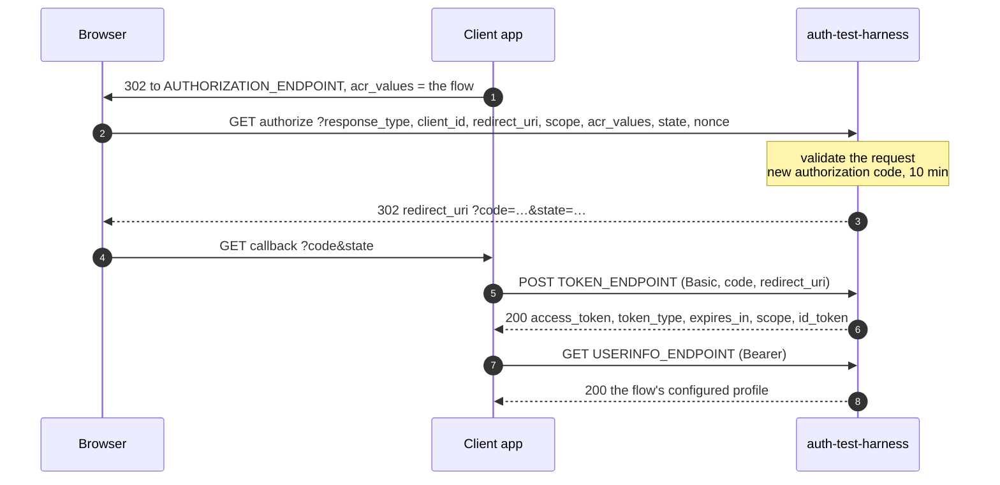
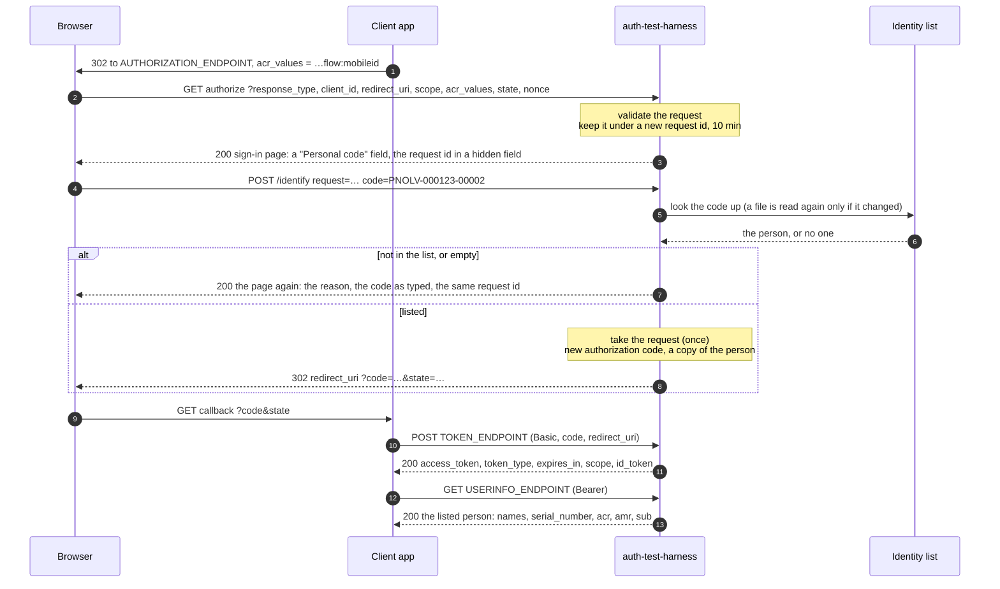
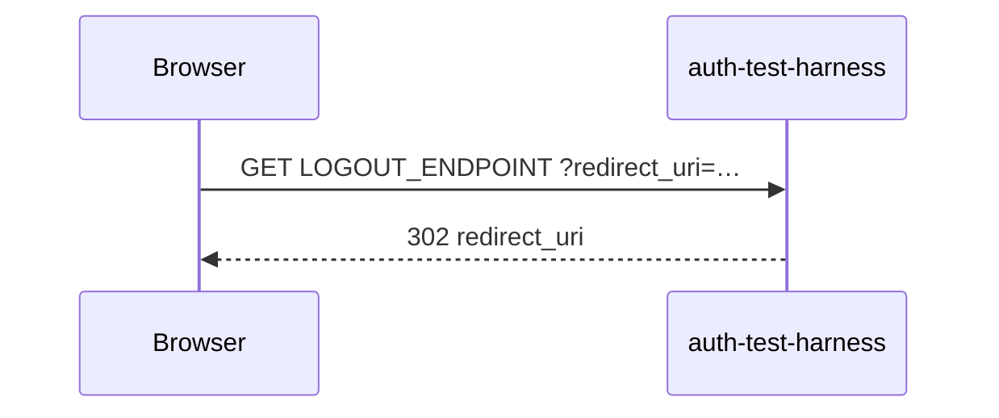

# Sign-in flows

How a sign-in runs through this service, in each identity mode. The endpoints, parameters and answers are
described in [API.md](API.md); the settings in the [README](README.md).

| `USED_IDENTITIES` | Mobile ID, eID Scan | Smart card, directory flows |
|---|---|---|
| `config` (default) | [redirect at once](#1-config-the-default), as the flow's configured profile | redirect at once, as the flow's configured profile |
| `list` | [the sign-in page asks for a personal code](#2-list); the login answers as the person the list names | redirect at once, as the flow's configured profile |

In both modes the client's side is the same: authorize, then token, then userinfo. The only difference is
what happens in the browser between the authorization request and the redirect back.

## 1. `config` (the default)

The authorization request is answered with a redirect back at once. Who signs in is the profile configured
for the requested flow.



1. The client sends the browser to the authorization endpoint with the flow it wants in `acr_values`.
2. The browser asks for it. A malformed request is answered `400` with an OAuth error (`invalid_request`, or
   `invalid_scope` for a scope not in `SCOPES_SUPPORTED`).
3. A valid request is answered at once: a new authorization code, sent back to `redirect_uri` with `state`.
4. The client receives the code at its callback.
5. It exchanges the code once, with the configured client credentials and the same `redirect_uri`.
6. The token answer carries `access_token`, `token_type: Bearer`, `expires_in: 600`, the granted `scope` and
   an `id_token`.
7. The client asks userinfo with the access token.
8. Userinfo answers as the requested flow's profile:

| Requested flow (`acr_values`) | Profile | `acr` | `amr` |
|---|---|---|---|
| `urn:eparaksts:authentication:flow:mobileid` | `MOBILE_*` | the flow | `urn:safelayer:tws:policies:authentication:adaptive:methods:mobileid` |
| `urn:eparaksts:authentication:flow:mobile-eid` | `EIDSCAN_*` | the flow | `urn:safelayer:tws:policies:authentication:adaptive:methods:mobileid` |
| `urn:eparaksts:authentication:flow:sc_plugin`, any other | `SC_*` | the flow | `urn:eparaksts:tws:policies:authentication:adaptive:methods:<segment>` |
| `urn:auth-test-harness:flow:directory`, `…:directory-guest` | `DIRECTORY_*` | none | `urn:auth-test-harness:methods:directory` |

The `acr` echoes the requested flow, and Mobile ID and eID Scan share one `amr`, as on the eParaksts
platform: a client tells the two apart by the `acr`. A profile's `sub` is the same on every login and differs
between profiles. Each profile's identity code is its own `*_SERIAL_NUMBER`, or `SERIAL_NUMBER` when unset.

## 2. `list`

For Mobile ID and eID Scan, the authorization request is answered with a sign-in page that asks for a personal
code. The login answers as the person the [identity list](README.md#the-identity-list) names for it: the
built-in twenty made-up people, or your own file when `IDENTITIES_FILE` is set. Every other
flow runs as in `config`.



1. The client sends the browser to the authorization endpoint, as in `config`.
2. The browser asks for it. The request is checked exactly as in `config`, and a valid request for Mobile ID or
   eID Scan is **kept** under a new random request id, for 10 minutes.
3. The browser is answered with the sign-in page (`200 text/html`, not cached): a heading naming the method, one
   field, *Personal code*, and the request id in a hidden field, posting to `/identify`.
4. The tester types a code and presses *Continue*. The code may be the full serial number (`PNOLV-…`) or the
   code without its prefix, in any letter case.
5. The service looks the code up in the list. With your own file, it first checks the file's modification
   time and size, and reads the file again only if either changed; a file that cannot be used is refused with
   a log line, and the last good list stays in use. The built-in list never changes.
6. The code is looked up in the list.
7. **Not listed:** the page comes back (`200`) with the reason (*"No one with this code is in the identity
   list."*, or *"Enter a personal code."*), the code as typed and the same request id, so the code can be
   corrected. The client sees nothing of this.
8. **Listed:** the waiting request is taken (it is answered once). A new authorization code is stored with **a
   copy of the person**, and the browser is sent back to `redirect_uri` with `code` and `state`, exactly as in
   `config`. A change to the list from here on does not change who this login names.
9. The client receives the code at its callback.
10. It exchanges the code, as in `config`.
11. The token answer is as in `config`.
12. The client asks userinfo with the access token.
13. Userinfo answers as the listed person:

| Claim | Value |
|---|---|
| `given_name`, `family_name` | as written in the list entry |
| `name` | `given_name` + `family_name` |
| `serial_number` | the entry's serial number, as written in the list (not as typed) |
| `sub` | derived from the method and the serial number: the same on every login by one method, kept across a rename and a restart, and different by Mobile ID and by eID Scan, as on the platform |
| `acr` | the requested flow |
| `amr` | `["urn:safelayer:tws:policies:authentication:adaptive:methods:mobileid"]`, for both methods |
| `domain`, `eips` | `citizen`, `""` |

The `id_token` names the same person with the same `sub`.

A request id the service does not hold (never issued, older than 10 minutes, or already answered) is answered
`400` with a page that says so, and no form. `GET /identify` answers `405`.

## 3. Logout

Served when `LOGOUT_ENDPOINT` is set, in either mode.



The service keeps no sign-in session, so there is nothing else to end. In `list` mode the next sign-in shows
the page again, and access tokens already issued stay valid until they expire. A missing or relative
`redirect_uri` is answered `400 invalid_request`.

## 4. Without a browser

Both flows can be driven by any HTTP client. `list` mode needs one extra request:

1. `GET` the authorization endpoint. In `list` mode the answer is the sign-in page. Read the request id from it:
   `name="request" value="([^"]+)"`.
2. `POST /identify` as a form, `request=<id>&code=<a listed code>`, without following the redirect. A listed
   code answers `302`, and its `Location` is the client's callback with `code` and `state`. An unknown code
   answers `200` (the page again), and an expired or used request answers `400`.
3. Exchange the code and read userinfo, as in `config`.

```sh
AZ=/trustedx-authserver/oauth/lvrtc-eipsign-as
REQ=$(curl -s "http://localhost:8081$AZ?response_type=code&client_id=demo&redirect_uri=https://example.com/cb&scope=urn:lvrtc:fpeil:aa&acr_values=urn:eparaksts:authentication:flow:mobileid&state=s1" \
  | sed -n 's/.*name="request" value="\([^"]*\)".*/\1/p')
curl -si -d "request=$REQ" -d code=000123-00002 http://localhost:8081/identify | grep -i '^location'
```

The Postman collection's *Identity list* requests run the same steps against the compose file's
`auth-test-harness-list` service.
